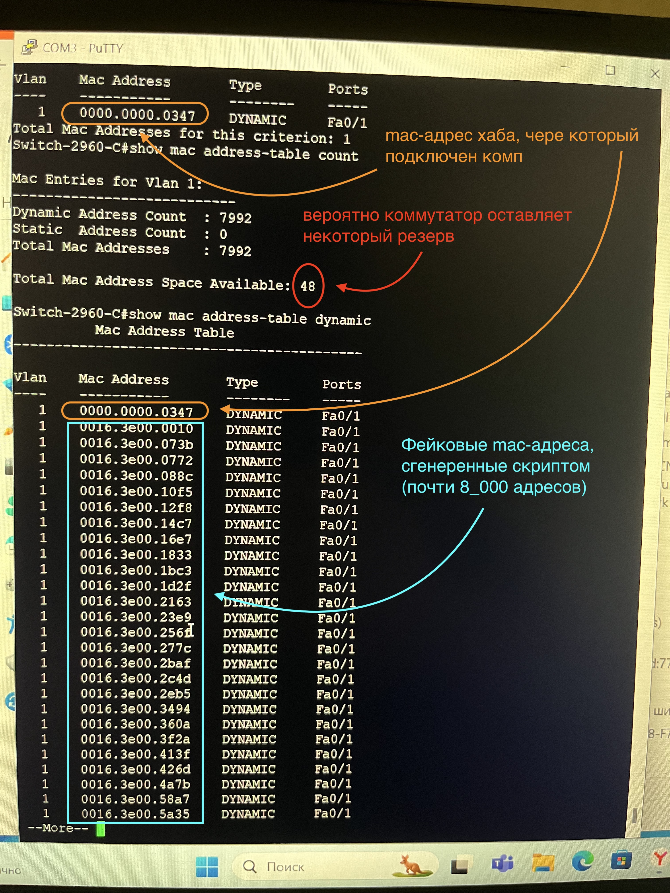

## Попробуем переполнить таблицу mac-адресов коммутатора

Используя скрипт, генерируем 12_000 arp_запросов:

В результате таблица коммутатора на 8_000 оказывается полностью заполненной:

TODO: конкретный адрес коммутатора заменить в скрипте на широковещательный адрес
