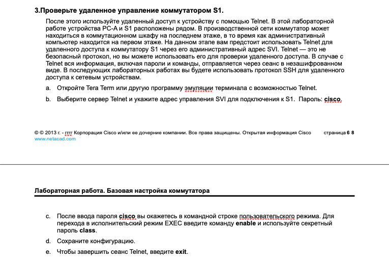

---

**консольное подключение** — это единственный способ первоначальной настройки сетевого оборудования. Никакие другие доступы к оборудованию (и ip-адреса на нем) на этом этапе еще не уставновлены

---


---

*a.* коммутатор имеет дефолтные настройки (startup-config is not present)

*b.* у коммутатора 2960-24TT из cpt: 24 FastEthernet, 2 GigabitEthernet0 и 16 line vty (0 - 15)

*c.* в пункте а. было сказано удалить startup-config, если он имеется на девайсе - так что startup-config отсутствует,
    команда `show startup-config` выводит сообщение:

    startup-config is not present

*d.* запускаем `show running-config`, видим что на vlan1 не назначен ip-адрес и интерфейс выключен
    mac-адрес можно посмотреть командой show interface Vlan1 - address is 0060.2fb5.7478 (bia 0060.2fb5.7478)

*e.* выполняем `show ip interface Vlan1`
    видим:

    Vlan1 is administratively down, line protocol is down
    Internet protocol processing disabled

*f.* выполняем `show ip interface Vlan1`
    видим, что ничего не изменилось:
    
    Vlan1 is administratively down, line protocol is down
    Internet protocol processing disabled
    

*g.* выполняем `show version`
    Версия ОС: 15.0(2)SE4
    Файл образа системы: c2960-lanbasek9-mz.150-2.SE4.bin

*h.* 
    - интерфейс включен, так как строка вывода говорит:
    FastEthernet0/6 is up, line protocol is up (connected)
    это указывает на то, что физический интерфейс работает, и протокол канального уровня также активен

    - если интерфейс был бы выключен, нужно было бы выполнить следующую команду в режиме конфигурации интерфейса:
    `Switch(config-if)# no shutdown`
    это включает интерфейс

    - MAC-адрес интерфейса: указан как "address is 00d0.bc70.9b06".

    - настройки скорости и дуплекса: Full-duplex, 100Mb/s
    это означает, что интерфейс настроен на работу в режиме полного дуплекса с пропускной способностью 100 Мбит/с

*i.* 

    Имя образа с пункта g. не изменилось: c2960-lanbasek9-mz.150-2.SE4.bin

    - 2960: Обозначает модель коммутатора Cisco Catalyst 2960.
    - lanbasek9: Указывает на тип функциональности и наличие криптографических функций (k9).
    - mz: Обозначает, что образ сжат и работает из оперативной памяти (RAM).
    - 150-2.SE4: Версия программного обеспечения IOS (15.0(2)SE4).
    - .bin: Расширение файла, указывающее, что это бинарный файл образа системы.  

---


---


команда `login` используется вместе с паролем для настройки аутентификации на определённых линиях (line) терминала, таких как консоль, виртуальные терминальные линии (VTY) или вспомогательные порты (AUX). Это требование ввода имени пользователя и пароля обеспечивает базовый уровень безопасности, предотвращая неавторизованный доступ к устройству. Когда команда login активирована для линии, любой пользователь, пытающийся получить доступ к устройству через эту линию, будет приглашен ввести правильные учетные данные, прежде чем ему будет разрешено взаимодействовать с устройством


---


---

*a.*
```
S1#show running-config
Building configuration...

Current configuration : 1544 bytes
!
version 15.0
no service timestamps log datetime msec
no service timestamps debug datetime msec
service password-encryption
!
hostname S1
!
enable secret 5 $1$mERr$9cTjUIEqNGurQiFU.ZeCi1
!
!
!
no ip domain-lookup
!
!
!
spanning-tree mode pvst
spanning-tree extend system-id
!
interface FastEthernet0/1
!
interface FastEthernet0/2
!
interface FastEthernet0/3
!
interface FastEthernet0/4
!
interface FastEthernet0/5
!
interface FastEthernet0/6
!
interface FastEthernet0/7
!
interface FastEthernet0/8
!
interface FastEthernet0/9
!
interface FastEthernet0/10
!
interface FastEthernet0/11
!
interface FastEthernet0/12
!
interface FastEthernet0/13
!
interface FastEthernet0/14
!
interface FastEthernet0/15
!
interface FastEthernet0/16
!
interface FastEthernet0/17
!
interface FastEthernet0/18
!
interface FastEthernet0/19
!
interface FastEthernet0/20
!
interface FastEthernet0/21
!
interface FastEthernet0/22
!
interface FastEthernet0/23
!
interface FastEthernet0/24
!
interface GigabitEthernet0/1
!
interface GigabitEthernet0/2
!
interface Vlan1
 ip address 192.168.1.2 255.255.255.0
!
banner motd ^C
        .__       .__           ____ 
  _____ |__| _____|  |__   ____/_   |
 /     \|  |/  ___/  |  \_/ __ \|   |
|  Y Y  \  |\___ \|   Y  \  ___/|   |
|__|_|  /__/____  >___|  /\___  >___|
      \/        \/     \/     \/     
Unauthorized access is strictly prohibited
^C
!
!
!
line con 0
 password 7 0822455D0A16
 logging synchronous
 login
!
line vty 0 4
 password 7 0822455D0A16
 login
 transport input telnet
line vty 5 15
 login
!
!
!
!
end


S1#
```

*b.*


в выводе команды show interface Vlan1 указана полоса пропускания (bandwidth) интерфейса. Здесь BW 100000 Kbit означает, что полоса пропускания этого интерфейса составляет 100000 килобит в секунду (Kbps), или 100 мегабит в секунду (Mbps)

эта информация указывает на максимальную пропускную способность интерфейса. Полоса пропускания (BW) — это величина, определяющая максимальное количество данных, которое может быть передано через интерфейс за единицу времени

---


---


---



---


---


---

1. для защиты от несанкционированного доступа
2. настроить и использовать доступ по ssh вместо telnet

---

