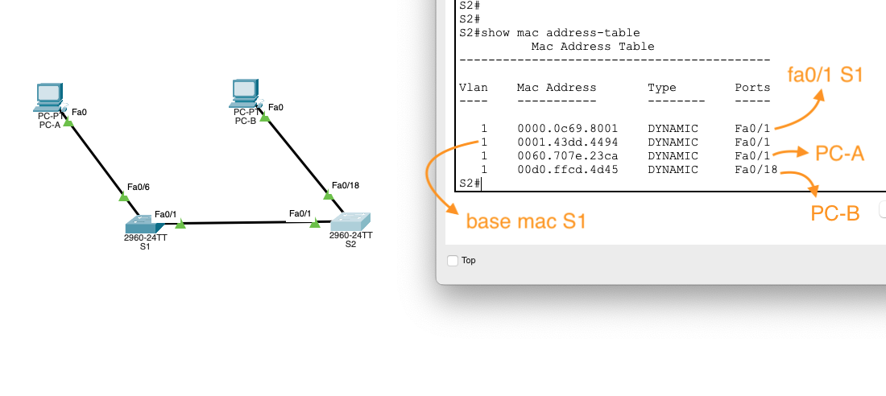

---

**Базовая настройка**

```
enable
configure terminal

! Имя хоста и баннер
hostname S1
banner motd = 
  _________       .__  __         .__        _____________ 
 /   _____/_  _  _|__|/  |_  ____ |  |__    /   _____/_   |
 \_____  \\ \/ \/ /  \   __\/ ___\|  |  \   \_____  \ |   |
 /        \\     /|  ||  | \  \___|   Y  \  /        \|   |
/_______  / \/\_/ |__||__|  \___  >___|  / /_______  /|___|
        \/                      \/     \/          \/      
=

! Пароль на EXEC
enable secret class

! Пароль на CONSOLE
line console 0
logging synchronous
password cisco
login
exit

! Пароль на vty
line vty 0 4
logging synchronous
password cisco
login

! ... и разрешить подключение по telnet
transport input telnet
exit

! Скрываем пароли
service password-encryption

! ip-адрес для коммутатора
interface vlan 1
ip address 192.168.1.11 255.255.255.0
no shutdown
exit

end

! Сохраняем конфигурацию
write memory
```

---


---

*a.* коммутатор имеет дефолтные настройки (startup-config is not present)

| Устройство                                 | MAC-адрес           |
|--------------------------------------------|---------------------|
| MAC-адрес компьютера PC-A                  | 0060.707E.23CA      |
| MAC-адрес компьютера PC-B                  | 00D0.FFCD.4D45      |
| МАС-адрес коммутатора S1 Fast Ethernet 0/1 | 0000.0c69.8001      |
| МАС-адрес коммутатора S2 Fast Ethernet 0/1 | 0050.0fe0.3401      |

---


---


Не зная mac-адресов устройств, но зная схему, мы можем догадаться что где два устройства за одним портом, это коммутатор S1 и компьютер А, а где одно устройство за портом, там компьютер B, но в общем случае (и на схемах побольше) это не очень рабочий подход

---


---


---


----




----


---

Чем больше оконечных устройств в канальной среде, тем больше широковещательных arp-запросов, что создает избыточный трафик и нагрузку на сеть, возможно переполнение mac-таблиц

---