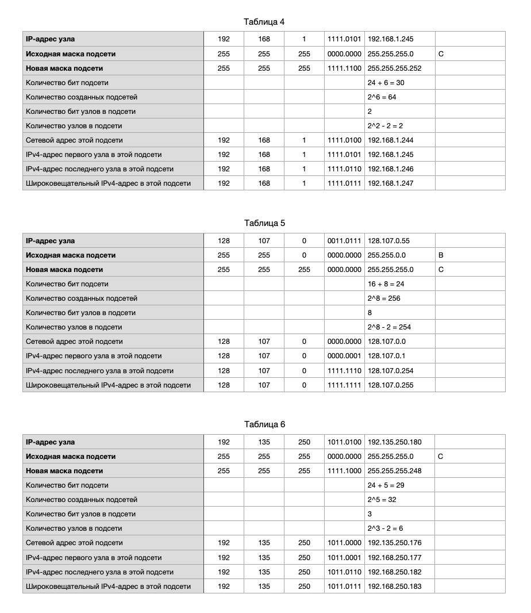

---

Маска подсети является частью адреса IPv4, поскольку она определяет, какая часть IP-адреса используется для идентификации сети и какая часть — для идентификации конкретного устройства (узла) в этой сети.

---

**Расчеты**

