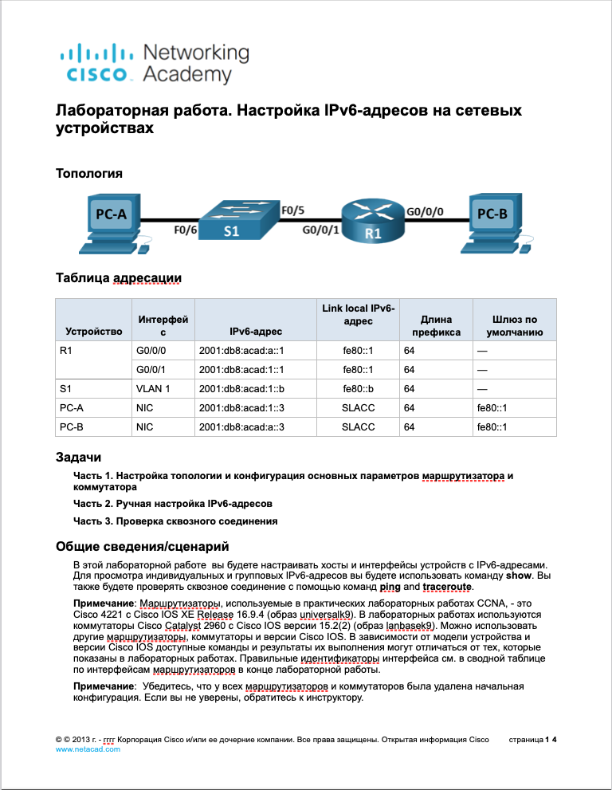
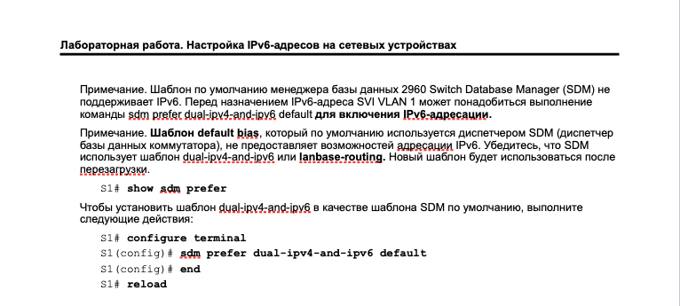

---

После этих действий, установлен шаблон dual-ipv4-and-ipv6:

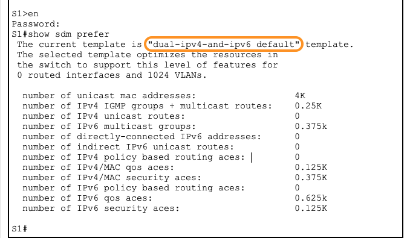

---

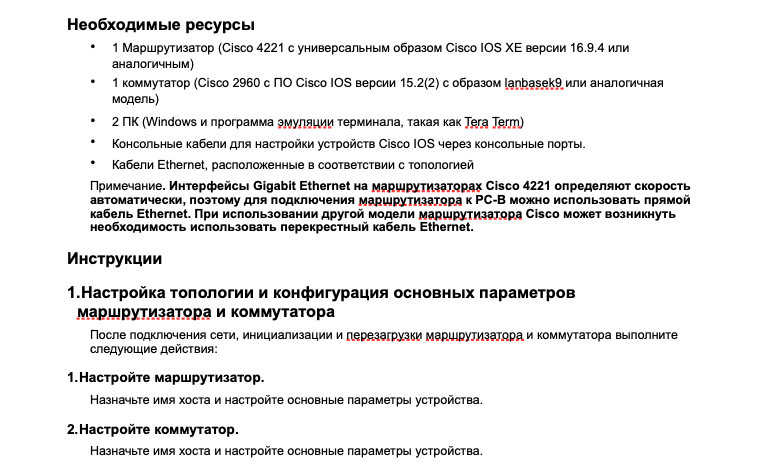

---

*1.* На маршрутизаторе настроено: имя хоста, пароль на консольное подключение и пароль на доступ к превелигированному exec

*2.* На коммутаторе настроено: имя хоста, пароль на консольное подключение и пароль на доступ к превелигированному exec

---

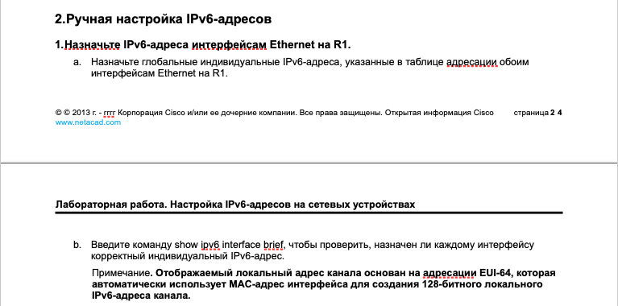

---

*a.*

```

interface g0/0/0
ipv6 address 2001:db8:acad:a::1/64
no shutdown

interface g0/0/1
ipv6 address 2001:db8:acad:1::1/64
no shutdown

```

*b.* 

```

show ipv6 interface brief

```

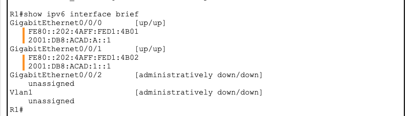

---

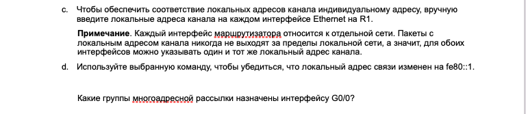

---

*c.*

```

interface g0/0/0
ipv6 address fe80::1 link-local

interface g0/0/1
ipv6 address fe80::1 link-local

```

*d.* 

```

show ipv6 interface brief

```

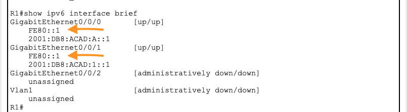

*?. Какие группы многоадресной рассылки назначены интерфейсу G0/0/0?* 

```

show ipv6 interface

```

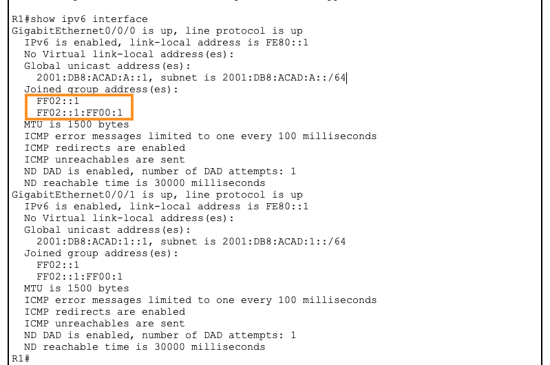

---

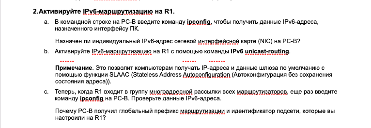

---

*a.*

```

ipconfig /all

```

Индивидуальный (глобальный) адрес ipv6 не назначен. Назначен link-local адрес, использующийся для коммуникации в пределах локальной сети:

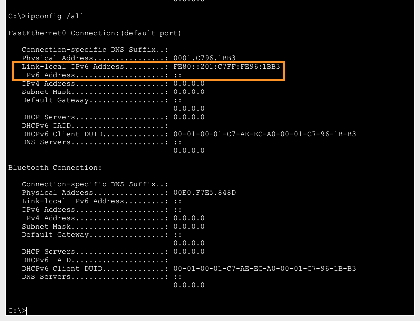

*b.* 

```

R1(config)#ipv6 unicast-routing

```

*c.*

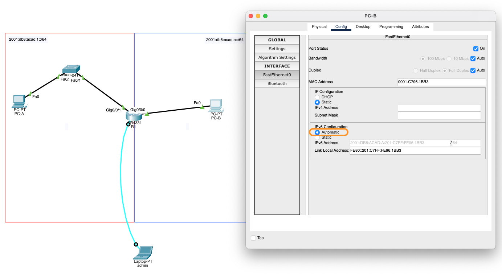

```

ipconfig /all

```

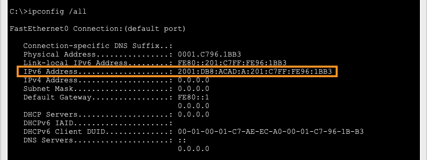

После включений ipv6-маршрутизации на R1 и переключения в настройках хоста "ipv6 configuration" в автоматический режим, индивидуальный ipv6-адрес был назначен хосту

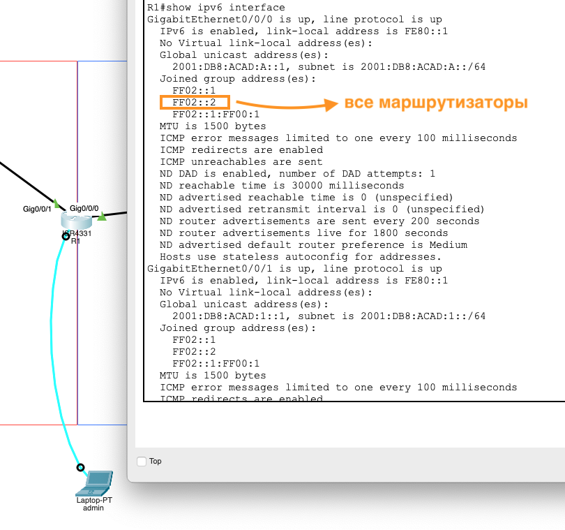

R1 теперь входит в группу многоадресной рассылки всех маршрутизаторов, он рассылает Router Advertisement, которые содержат информацию о сети и параметры конфигурации.

SLAAC (Stateless Address Autoconfiguration) - это технология, которая позволяет хостам  автоматически настраивать свои IPv6-адреса на основе префиксов, объявленных маршрутизатором. Когда PC-B получает RA от R1, он использует информацию о глобальном префиксе маршрутизации и идентификаторе подсети, чтобы создать свой собственный глобальный уникальный IPv6-адрес

---

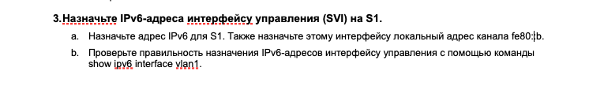

---

*a.*

```

interface vlan 1
ipv6 address 2001:db8:acad:1::b/64
ipv6 address fe80::b link-local
no shutdown

```

*b.*

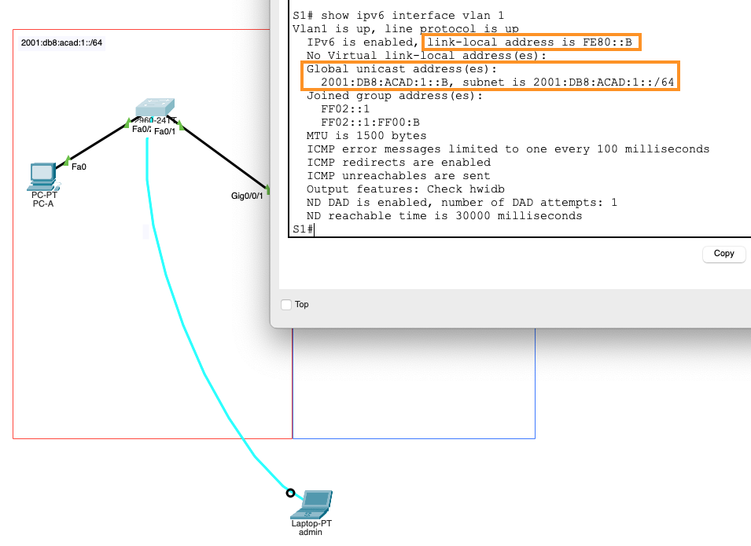

---

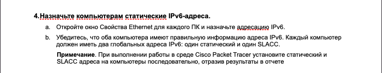

---

*a.*

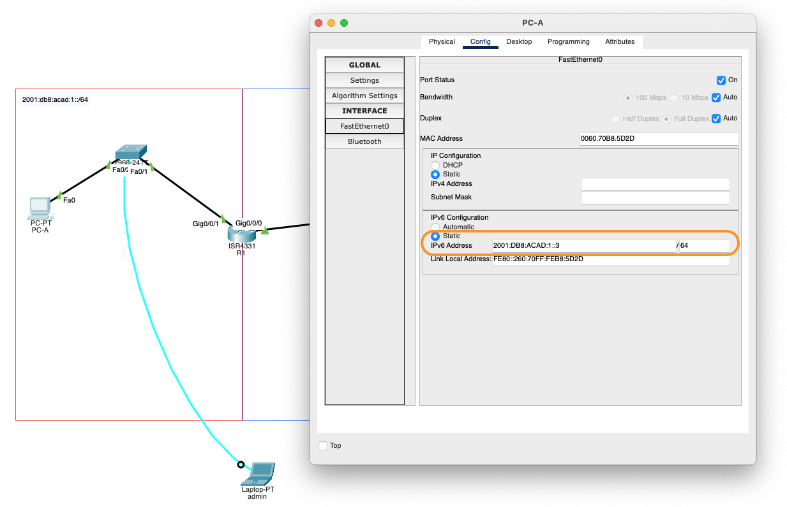

*b.*

```

PC-A>ipconfig /all

```

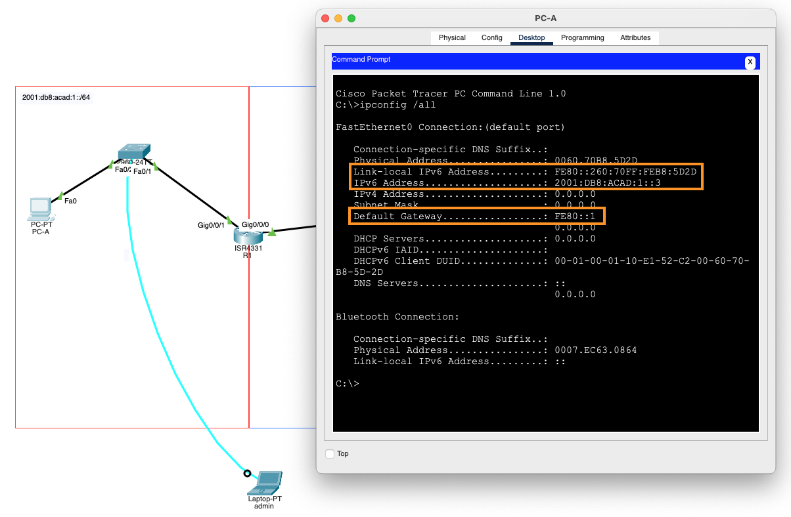

```

PC-B>ipconfig /all

```

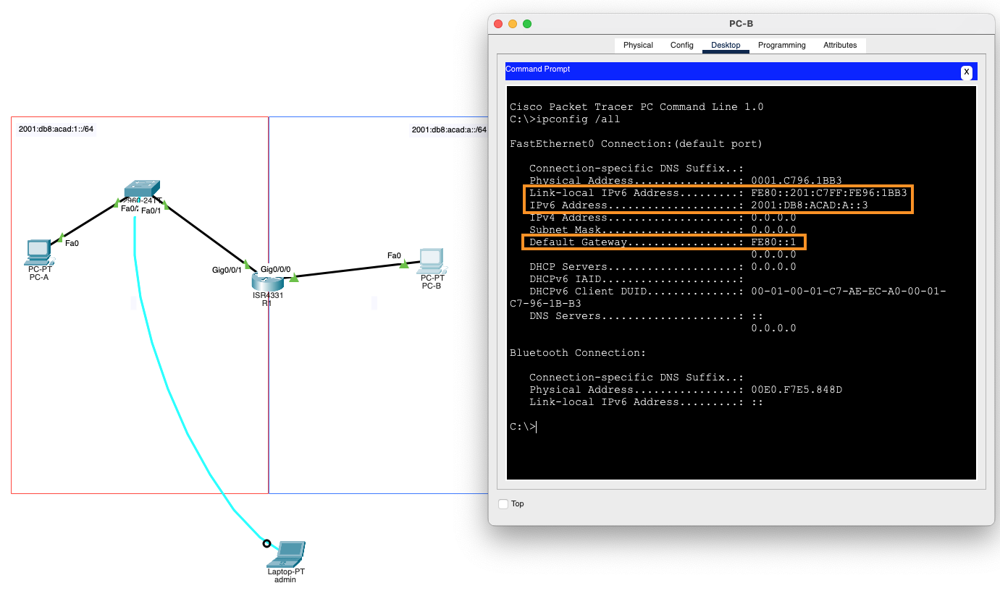

---

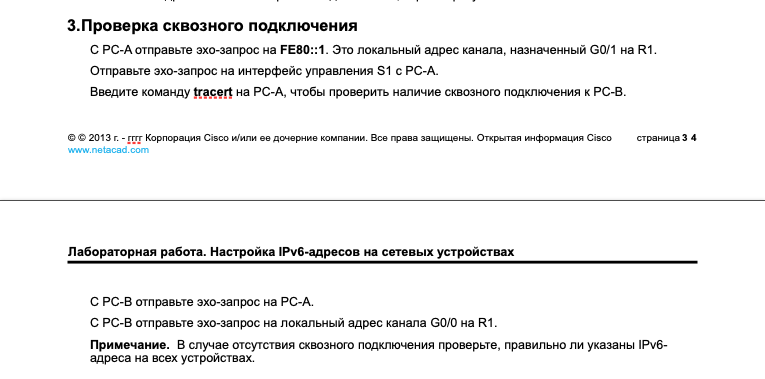

---

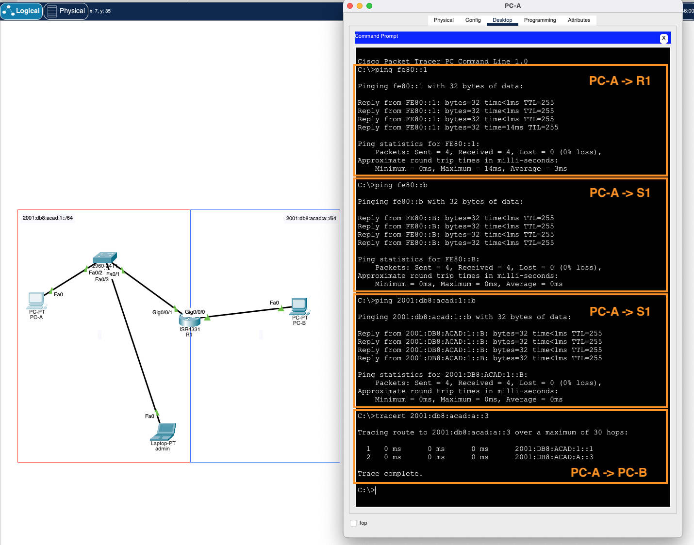
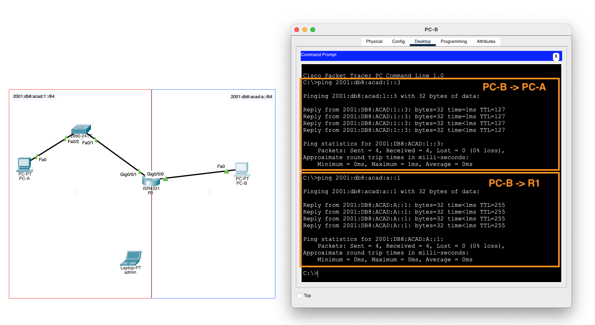

---

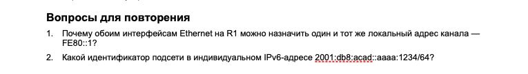

---

*1.* "Каждый интерфейс маршрутизатора относится к отдельной сети. Пакеты с локальным адресом канала никогда не выходят за пределы локальной сети, а значит, для обоих интерфейсов можно указывать один и тот же локальный адрес канала."

*2.* Идентификатор подсети в индивидуальном IPv6-адресе 2001:db8:acad::aaaa:1234/64 - 2001:db8:acad:0000::/64.

---
