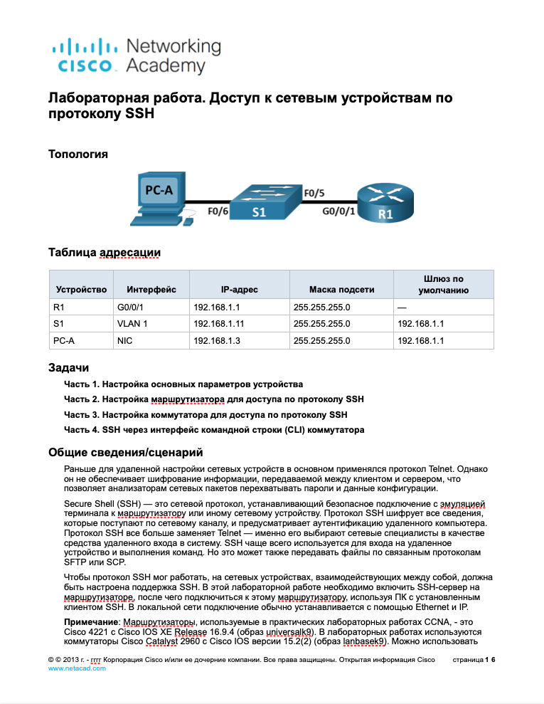
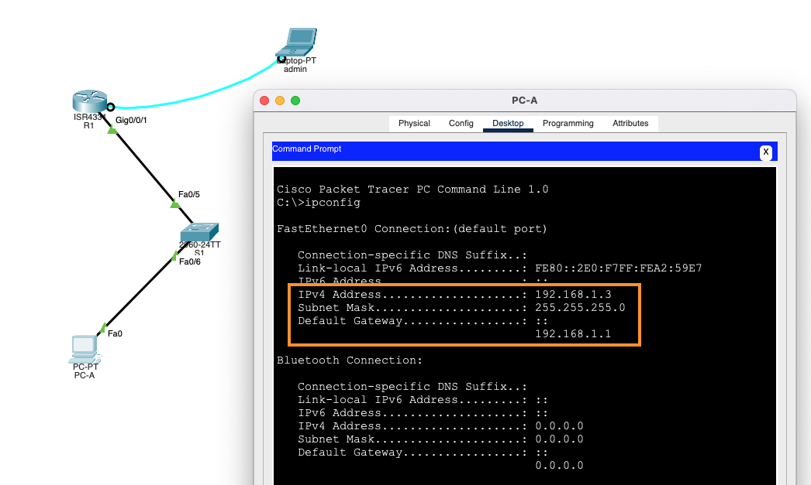
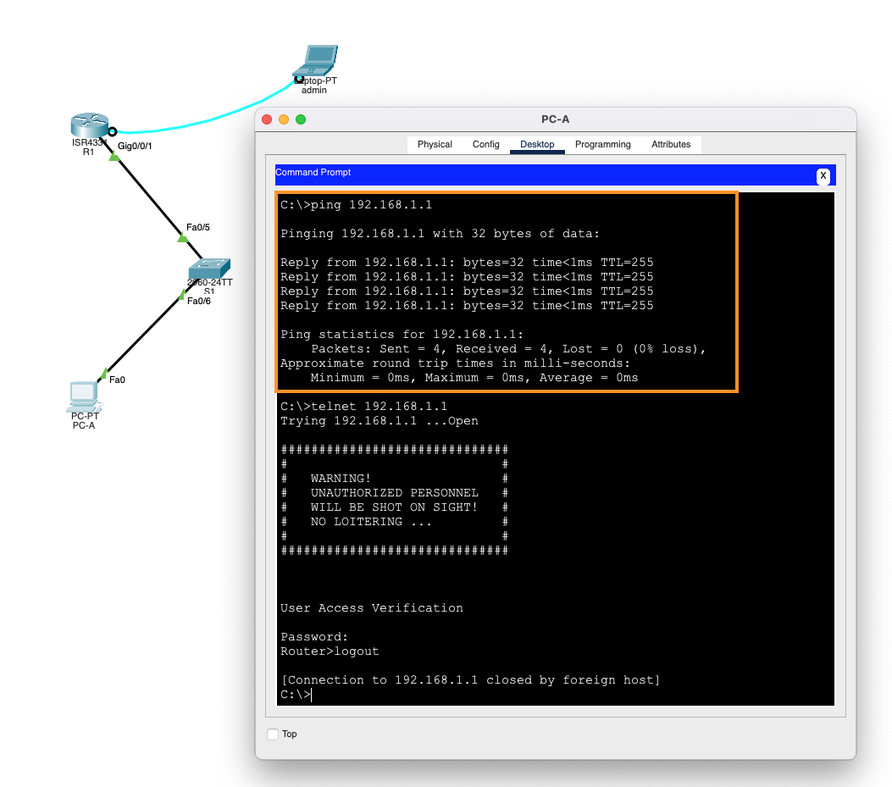
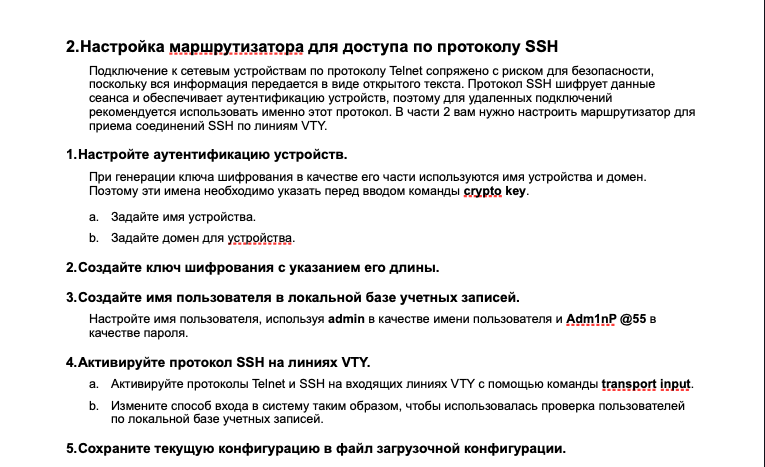
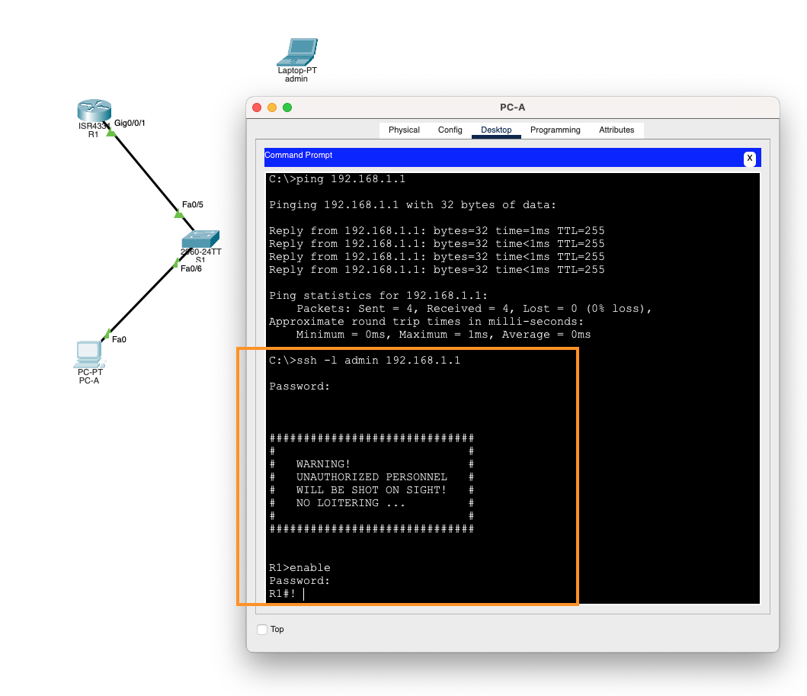
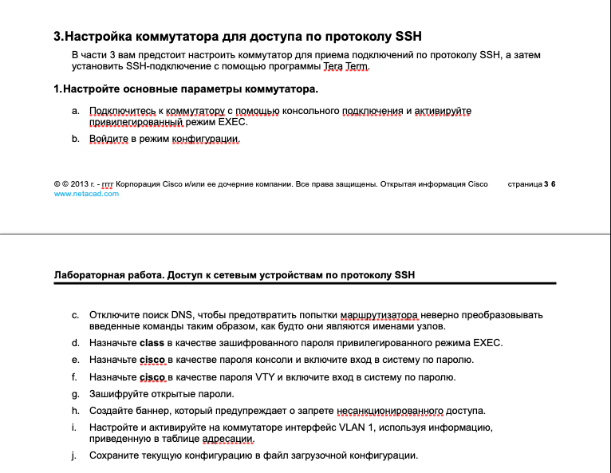
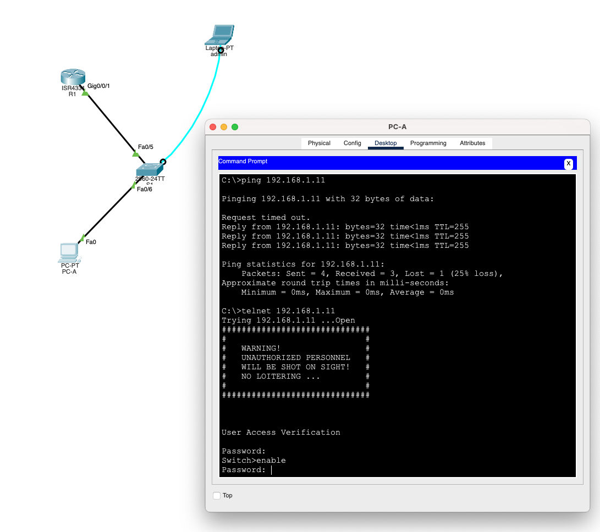
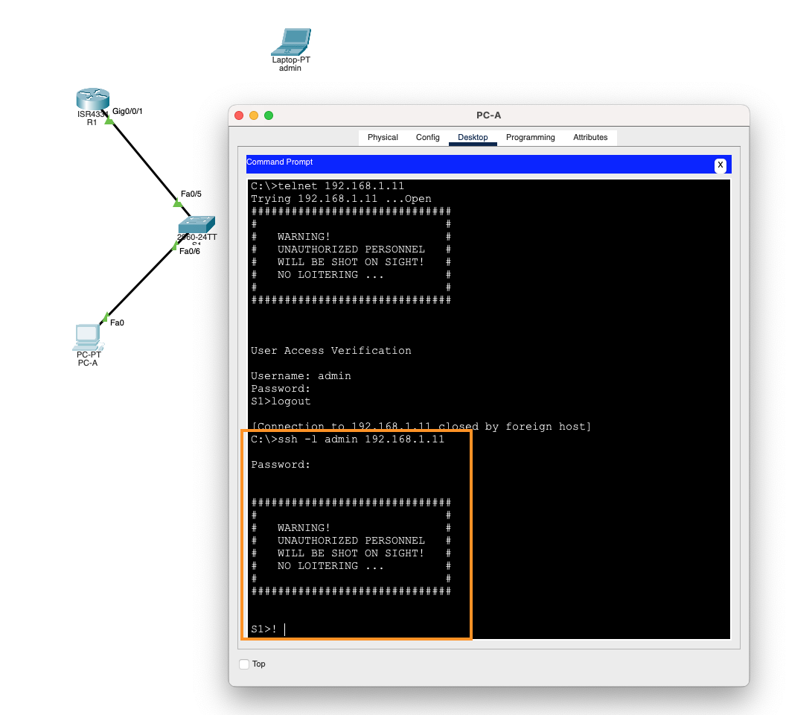
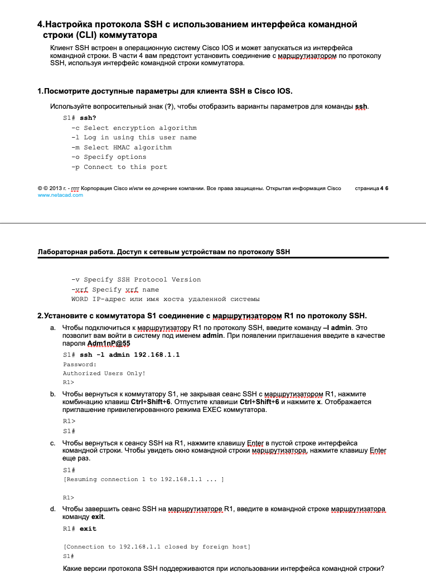
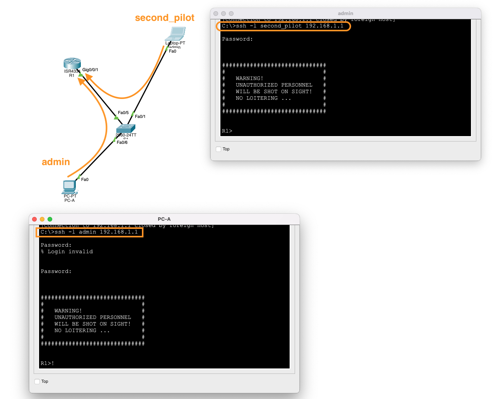

```

enable
configure terminal
no ip domain-lookup
enable secret class

line console 0
password cisco
login

line vty 0 4
password cisco
login
exit

service password-encryption

banner motd =
##############################
#                            #
#   WARNING!                 #
#   UNAUTHORIZED PERSONNEL   #
#   WILL BE SHOT ON SIGHT!   #
#   NO LOITERING ...         #
#                            #
##############################
=

interface g0/0/1
ip address 192.168.1.1 255.255.255.0
no shutdown
end

copy running-config startup-config

```


---



---


---



---



```

hostname R1
ip domain-name example.com

crypto key generate rsa
! выбираем размер ключа: 2048
ip ssh version 2

username admin secret Adm1nP@55

line vty 0 4
no password
login local
transport input all
end

copy running-config startup-config

```


---



---



```

enable
configure terminal
no ip domain-lookup
enable secret class

line console 0
password cisco
login

line vty 0 4
password cisco
login
exit

service password-encryption

banner motd =
##############################
#                            #
#   WARNING!                 #
#   UNAUTHORIZED PERSONNEL   #
#   WILL BE SHOT ON SIGHT!   #
#   NO LOITERING ...         #
#                            #
##############################
=

interface vlan 1
ip address 192.168.1.11 255.255.255.0
no shutdown
end

copy running-config startup-config

```

---



---


```

hostname S1
ip domain-name example.com

crypto key generate rsa
! размер ключа выбираем: 2048
ip ssh version 2

username admin secret Adm1nP@55

line vty 0 4
no password
login local
transport input all
end

copy running-config startup-config

```


---



---



---

При выполнении команды ssh из CLI коммутатра, можем явно указать желаемую версию протокола - 1 или 2:

```

ssh -l admin -v 1 192.168.1.1
ssh -l admin -v 2 192.168.1.1

```

Поскольку на маршрутизаторе при настройке была указана вторая версия ssh, первая команда сразу же закрывает соединение, вторая успешно выполняется

---


---

Заводим на маршрутизаторе новую запись для еще одного пользоватля:

```

username second_pilot secret love

```

и можем подключаться одновременно:

---



---