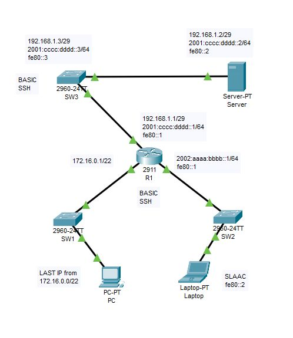

---

*R1*

```

hostname R1

ipv6 unicast-routing

interface g0/0
ip address 192.168.1.1 255.255.255.248
ipv6 address fe80::1 link-local
ipv6 address 2001:cccc:dddd::1/64
no shutdown

interface g0/1
ip address 172.16.0.1 255.255.252.0
no shutdown

interface g0/2
ipv6 address fe80::1 link-local
ipv6 address 2002:aaaa:bbbb::1/64
no shutdown

ip domain-name example.com
crypto key generate rsa
! 2048
ip ssh version 2

username root secret love

line vty 0 4
login local
transport input ssh

```

*SW1*

```

hostname SW1

```

*SW2*

```

hostname SW2

sdm prefer dual-ipv4-and-ipv6 default
reload

```

*SW3*

```

hostname SW3

sdm prefer dual-ipv4-and-ipv6 default
reload

interface vlan 1
ip address 192.168.1.3 255.255.255.248
ipv6 address fe80::3 link-local
ipv6 address 2001:cccc:dddd::3/64
no shutdown

! После настройки шлюза коммутатор сможет подключаться к удаленным сетям,
! с которыми ему необходимо взаимодействовать
ip default-gateway 172.16.0.1
ipv6 route ::/0 2001:cccc:dddd::1

ip domain-name example.com
crypto key generate rsa
! 2048
ip ssh version 2

username admin secret god

line vty 0 15
login local
transport input ssh

```

*Server*

```

ip: 192.168.1.2 255.255.255.248
ipv4 gefault gateway: 192.168.1.1

ipv6 link-local: fe80::2
ipv6: 2001:cccc:dddd::2/64
ipv6 gefault gateway: 2001:cccc:dddd::1

```

*PC*

```

ip: 172.16.3.254 255.255.252.0 <- Last IP from 172.16.0.0/22
gefault gateway: 172.16.0.1

```

*Laptop*

```

ipv6 link-local: fe80::2
ipv6: SLAAC
ipv6 gefault gateway: auto

```

---